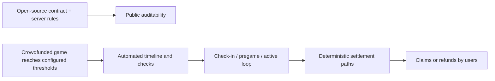
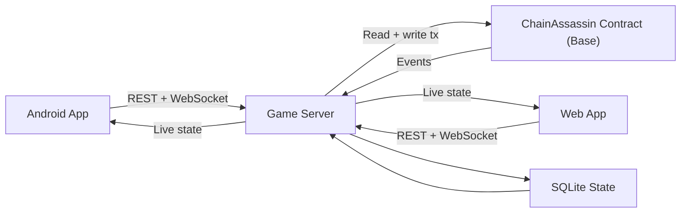
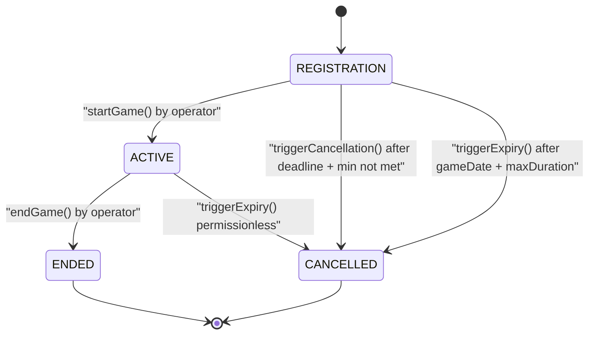
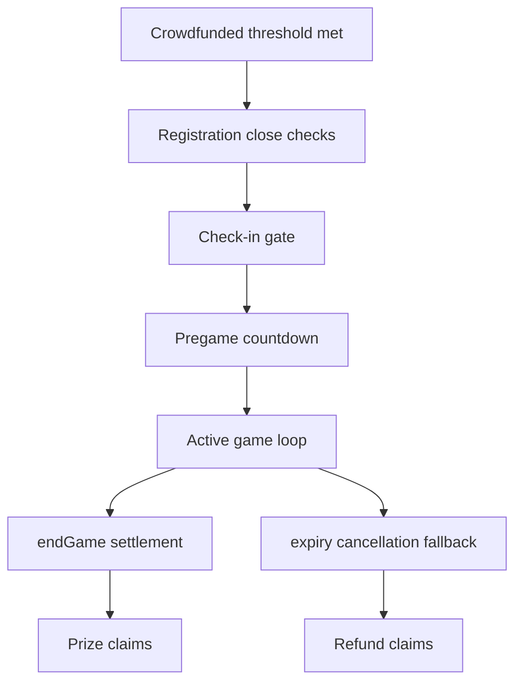
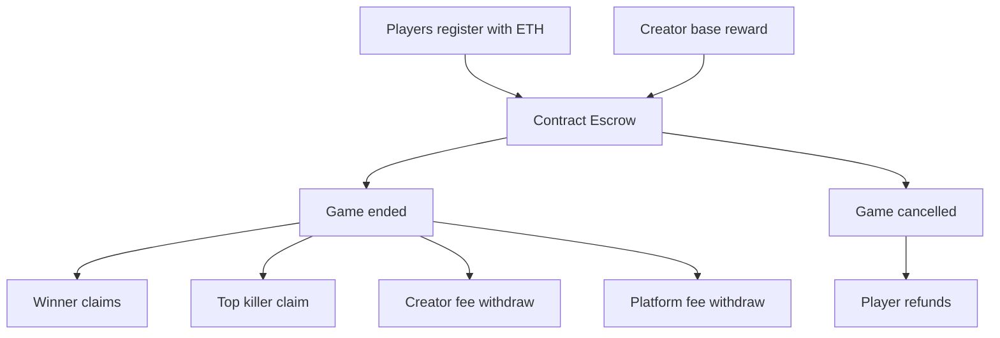
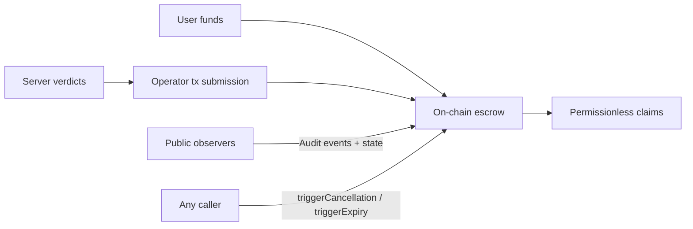

# Chain Assassin Whitepaper

Version 1.1  
Date: February 13, 2026

## 1. Abstract

Chain Assassin is a crypto-native, real-world elimination game with on-chain escrow and settlement. Players join games by paying ETH, verify presence in-person, and compete inside a shrinking geofence. The server enforces real-time game mechanics (check-in, target assignment, QR kill validation, GPS/BLE constraints), while the smart contract secures funds, enforces payout math, and preserves permissionless exits through cancellation and expiry paths.

The protocol is open-source and designed for moderatorless operation at runtime: once a game is crowdfunded (meets configured participation/escrow conditions), it advances through scheduled phases automatically without requiring a live human referee.

The protocol is designed around practical trust minimization:

- Low-latency mechanics off-chain for playability.
- Financial integrity on-chain for transparency and custody safety.

## 2. Problem

Most real-world prize games suffer from three trust failures:

1. Custody risk: users must trust a private operator to hold prize funds.
2. Settlement opacity: payout calculations and outcomes are not publicly auditable.
3. Liveness fragility: when infra fails, refunds and closure are often discretionary.

## 3. Design Goals

Chain Assassin targets:

1. Verifiable settlement integrity.
2. User-owned claim paths.
3. Real-time gameplay without L1/L2 latency overhead.
4. Gradual decentralization without breaking UX.
5. Open-source verifiability and moderatorless execution.

### 3.1 Open-source and Moderatorless Principle

Chain Assassin is implemented as auditable open-source infrastructure across contract, server, and client surfaces. Anyone can inspect the exact rules that move funds and the exact runtime logic that drives game progression.

Moderatorless means no live human judge is needed to manually advance stages or approve outcomes during normal operation. Phase transitions and rule enforcement are system-driven.

## 4. System Architecture

Chain Assassin is a four-layer stack.

- Smart contract (Base): escrow, phases, claim logic, fee accounting.
- Server: game orchestration, anti-cheat checks, event indexing, state recovery.
- Android app: wallet operations + action-heavy gameplay interactions.
- Web app: spectator + discovery + lightweight management.

## 5. Lifecycle Model

### 5.1 On-chain phases

Game phase enum:

- `REGISTRATION`
- `ACTIVE`
- `ENDED`
- `CANCELLED`

### 5.2 Operational server flow

1. Index `GameCreated` and schedule timeline checks.
2. Track registrations from on-chain events.
3. Run check-in, pregame, and active-game loops.
4. Verify kills with QR payload + GPS + BLE constraints.
5. Write canonical game outcomes on-chain.
6. Recover active/registration timelines from DB after restart.

### 5.3 Autonomous Run After Crowdfunding

A game is considered crowdfunded once it has sufficient participation and escrow to satisfy configured start criteria (for example min-player constraints and scheduled start conditions).

After that point, progression is autonomous:

1. Registration closes by time/conditions.
2. Check-in and pregame gates are enforced by server logic.
3. Active phase runs continuously with zone/kill validation loops.
4. End-state is written on-chain, or expiry path is triggered if needed.

No discretionary live moderator is required for standard game progression.

## 6. Check-in and Match Start Policy

Current policy is safety-biased and liveness-aware:

1. Check-in stays open until enough players are checked in to satisfy configured prize slots.
2. If expiry is reached before enough checked-in players, game is cancelled.
3. Cancelled users retain refund claimability on-chain.

This avoids starting under-participated rounds while preserving user exit guarantees.

## 7. Financial Architecture

### 7.1 Escrow composition

For each game, escrow value is:

- base reward deposit (optional), plus
- sum of exact entry fees.

### 7.2 Distribution model

Basis points (`BPS_TOTAL = 10_000`) are allocated to:

- 1st / 2nd / 3rd place
- most kills
- creator fee
- platform fee

### 7.3 Claim model

- Winners claim with `claimPrize()`.
- Cancelled-game participants claim with `claimRefund()`.
- Platform and creators withdraw accrued fees via dedicated withdraw functions.

## 8. Trust and Security Model

### 8.1 Explicit trust boundary

Chain Assassin is not fully trustless gameplay; it is trust-minimized settlement.

Trusted components:

- operator role for game result reporting,
- server-side verification engine.

Runtime governance intent:

- no live moderator interventions are required for normal game flow,
- no manual referee approvals are required per kill/phase transition.

Trustless/permissionless properties:

- escrow custody in immutable contract state,
- deterministic payout/refund formulas,
- permissionless cancellation paths,
- user-executed pull-claims.

### 8.2 Contract hardening

- OpenZeppelin `ReentrancyGuard` on value transfer paths.
- Strict phase gates and role checks.
- Strong constraints on bps sums, deadlines, winner validity.
- Pull-pattern claims reduce forced-transfer edge cases.

### 8.3 Outage handling

If server/operator stalls during `ACTIVE`, funds are not permanently trapped:

- after `gameDate + maxDuration`, any address can invoke expiry cancellation,
- users can claim refunds from contract state.

## 9. Anti-Cheat Framework

Current anti-cheat controls are multi-signal:

1. QR proof validation against assigned target context.
2. GPS proximity checks with configurable thresholds.
3. BLE nearby-address corroboration for local presence.
4. Zone and heartbeat elimination enforcement.

Known residual risk:

- advanced spoofing remains possible and requires continued detection tuning, penalty policy, and telemetry-driven heuristics.

## 10. Product Surface Split

### 10.1 Mobile app (action plane)

Used for:

- wallet operations,
- registration tx flow,
- check-in and kill scans,
- gameplay map + tactical interactions,
- claim actions.

### 10.2 Website (spectator + growth plane)

Used for:

- upcoming game discovery,
- live spectator views,
- historical game pages,
- social sharing and funneling into app actions.

## 11. Economics and Ecosystem

Chain Assassin establishes an on-chain game economy where:

- players compete for transparently escrowed rewards,
- organizers can run repeatable templates with deterministic payout rails,
- spectators amplify growth through live-sharing loops.

The long-term model supports city-level circuits, hosted tournaments, and protocolized organizer tooling.

## 12. Decentralization Roadmap

### Phase A: Operational reliability

- hardened recovery and indexing,
- stronger simulation/e2e coverage,
- richer observability.

### Phase B: Organizer scale

- organizer dashboards and templates,
- anti-abuse analytics,
- deeper spectator media stack.

### Phase C: Trust minimization expansion

- multi-operator governance structures,
- portable attestation formats,
- optional challenge/dispute layers for contested outcomes.

## 13. Token Position

No native token is required today.

- Settlement currency: ETH on Base.
- Revenue rails: creator + platform basis-point shares.
- Treasury discipline: on-chain accrual + explicit withdrawal paths.

A token should only be introduced when it delivers concrete, non-redundant utility.

## 14. Risk Register

1. Off-chain trust concentration.  
Mitigation: strict settlement boundaries, role controls, progressive decentralization.

2. Location/BLE spoofing pressure.  
Mitigation: layered verification and adaptive anti-cheat policy.

3. Infrastructure outages.  
Mitigation: startup recovery + permissionless expiry cancellation.

4. Jurisdictional game-prize regulation variability.  
Mitigation: geofencing, policy controls, conservative compliance posture.

## 15. Public Deployment (Current)

- Network: Base Sepolia
- Contract: `0x6c14a010100cf5e0E1E67DD66ef7BBb3ea8B6D69`
- Explorer: <https://sepolia.basescan.org/address/0x6c14a010100cf5e0E1E67DD66ef7BBb3ea8B6D69>

## 16. Conclusion

Chain Assassin demonstrates a practical crypto-native architecture for real-world games:

- real-time rules off-chain for speed,
- value custody and settlement on-chain for integrity,
- permissionless user exits when operations fail.

This is pragmatic decentralization: protocol-level financial guarantees with production-grade gameplay systems.
